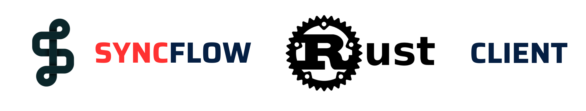

# `SyncFlow` Rust Client

<p align="center">
  <a href="https://github.com/oele-isis-vanderbilt/SyncFlow/tree/main/crates/client"></a>
</p>
<p align="center">
    <em>Reusable Rust client implementation for SyncFlow.</em>
</p>


This is a reusable Rust client implementation for SyncFlow. The idea here is to create necessary functionality to interact with the SyncFlow api, in a Rust application. Primary beneficiaries of this package could be clients to SyncFlow, who have their own backend in Rust and want to integrate with SyncFlow.

## Features
- Manage sessions, participants and recordings for a SyncFlow project
- Easy integration with existing Client applications

## Installation
Add the following to your `Cargo.toml`.

```sh
[dependencies]
...
syncflow_client = { git = "https://github.com/oele-isis-vanderbilt/SyncFlow.git", branch = "main", package="client" }
syncflow_shared = { git = "https://github.com/oele-isis-vanderbilt/SyncFlow.git", branch = "main", package="shared" }
...
```


## Usage
Installation provides a project client that can be used to interact with the SyncFlow API

```rust
use std::sync::Arc;

use syncflow_client::ProjectClient;
use dotenvy::dotenv;

use syncflow_shared::livekit_models::{TokenRequest, VideoGrantsWrapper};

#[tokio::main]
async fn main() -> Result<(), Box<dyn std::error::Error>> {
    dotenv().ok();

    gstreamer::init().unwrap();
    std::env::set_var("RUST_LOG", "info");
    env_logger::init();

    let base_url = std::env::var("SYNCFLOW_BASE_URL").expect("SYNCFLOW_BASE_URL must be set");
    let project_id = std::env::var("SYNCFLOW_PROJECT_ID").expect("SYNCFLOW_PROJECT_ID must be set");
    let syncflow_api_key = std::env::var("SYNCFLOW_API_KEY").expect("SYNCFLOW_API_KEY must be set");
    let syncflow_api_secret =
        std::env::var("SYNCFLOW_API_SECRET").expect("SYNCFLOW_API_SECRET must be set");

    let project_client = ProjectClient::new(
        &base_url,
        &project_id,
        &syncflow_api_key,
        &syncflow_api_secret,
    ); // Create a new project client

    // Create a new session
    let session_request = Default::default();

    let session = project_client.create_session(&session_request).await?;
    log::info!("Created new session {:#?}", session);
    let token_request = TokenRequest {
        identity: "SyncFlowProjectClient".to_string(),
        name: Some("SyncFlow Project Client".to_string()),
        video_grants: VideoGrantsWrapper {
            room: session.name,
            room_create: false,
            room_join: true,
            can_publish: true,
            ..Default::default()
        },
    };

    let session_token = project_client
        .generate_session_token(&session.id, &token_request)
        .await?;

    let server_url = session_token.livekit_server_url.as_ref().unwrap();

    // ... Use this token to join the session
    Ok(())
}

```

See this examples [files](./examples) for a detailed usage examples.

## License
[APACHE 2.0](./LICENSE)

## Funding Information
This work is supported by the National Science Foundation under Grant No. DRL-2112635.
