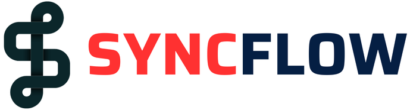
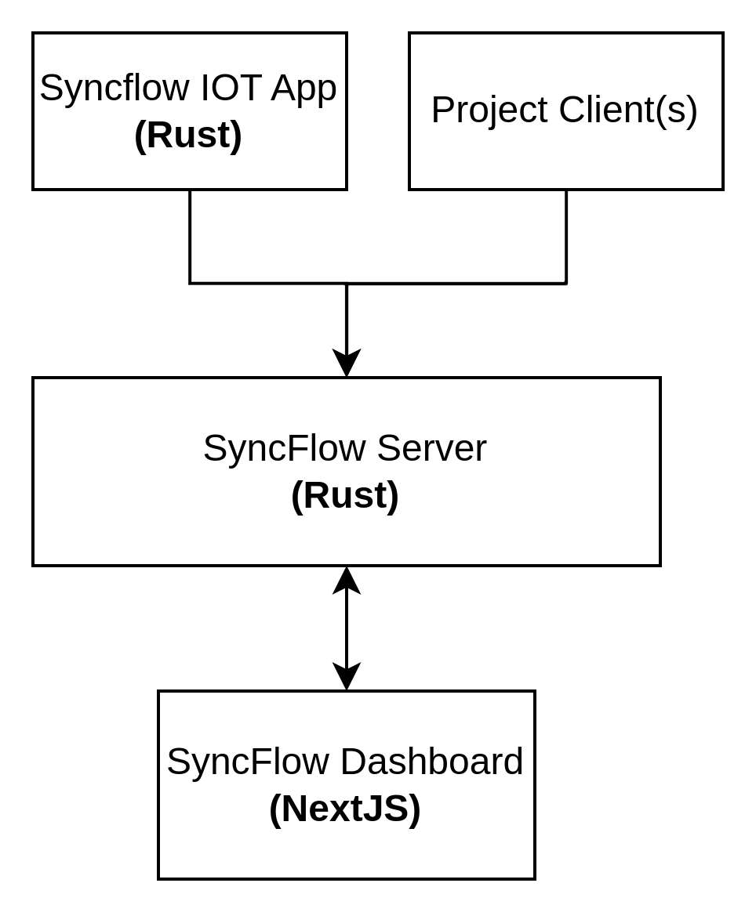

Learning Analytics or any Analytics domain for that matter largely relies on the individual modalities used for the analysis routines for that are readily available. With the advent of multimodal AI as well as large language models, most fields are pivoting towards data hungry analysis routines often powered by deep learning.

To that end, modernizing the tech stack used in traditional MMLA settings for data collection and analysis is pivotal to continued evolution of the domain and bringing the latest of the ML world to MMLA.

`SyncFlow` is a platform for multimodal data streaming and collection based on [LiveKit](https://livekit.io). The SyncFlow platform, leverages video conferencing and data channel based data streaming to monitor and collect data from different learning/training environments.

SyncFlow aims to be a complete multimedia solution for collecting/analyzing multimodal data from learning/training environments, with:

1. Support for multimedia streaming between consumer and IoT devices
2. Non login devices integration with SyncFlow IOT Client App
3. Full stack AI Deoployment (planned)

Our Platform is designed to provide you all the batteries you need to deliver/monitor AI driven multimodal applications in realtime.

## Problem Statement
Many learning/traning enviornments used in different domains have a common requirements from an analytics research standpoint. With multimodal AI, analysis and other domains

## LiveKit

## SyncFlow Architecture

<em>SyncFlow Architecture</em>

## Registration and Account Creation
